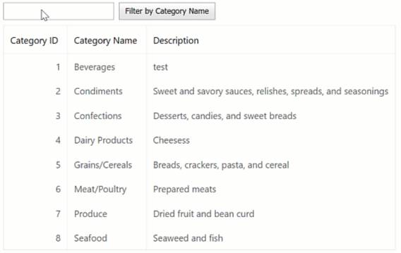

<!-- default badges list -->

[](https://supportcenter.devexpress.com/ticket/details/E3583)
[](https://docs.devexpress.com/GeneralInformation/403183)
<!-- default badges end -->
# GridView for ASP.NET Web Forms - How to apply a filter to a column on the client side
<!-- run online -->
**[[Run Online]](https://codecentral.devexpress.com/128533319/)**
<!-- run online end -->

This example demonstrates how to use a text string from an external text box to filter a grid column on the client.



## Overview

Follow the steps below:

1. Create the [Grid View](https://docs.devexpress.com/AspNet/DevExpress.Web.ASPxGridView) control, populate it with columns, and bind it to a data source.

    ```aspx
    <dx:ASPxGridView ID="grid" ClientInstanceName="grid" runat="server" AutoGenerateColumns="False"
        DataSourceID="ds" KeyFieldName="CategoryID">
        <Columns>
            <dx:GridViewDataTextColumn FieldName="CategoryID" ReadOnly="True" VisibleIndex="0">
                <EditFormSettings Visible="False" />
            </dx:GridViewDataTextColumn>
            <dx:GridViewDataTextColumn FieldName="CategoryName" VisibleIndex="1" />
            <dx:GridViewDataTextColumn FieldName="Description" VisibleIndex="2" />
        </Columns>
    </dx:ASPxGridView>
    <asp:AccessDataSource ID="ds" runat="server" DataFile="~/App_Data/nwind.mdb"
        SelectCommand="SELECT [CategoryID], [CategoryName], [Description] FROM [Categories]">
    </asp:AccessDataSource>
    ```

2. Add a text box and a button. When a user enters a text string in the text box and clicks the button, the grid filters a particular column by the entered string. To enable this behavior, handle the button's client-side [Click](https://docs.devexpress.com/AspNet/js-ASPxClientButton.Click) event. In the handler, call the grid's [AutoFilterByColumn](https://docs.devexpress.com/AspNet/js-ASPxClientGridView.AutoFilterByColumn(column-val)) method and pass the edit value of the text box as a parameter.

    ```aspx
    <dx:ASPxTextBox ID="txtFilter" ClientInstanceName="txtClientFilter" runat="server" ... />
    <dx:ASPxButton ID="btnFilter" ClientInstanceName="btnFilter" runat="server" Text="Filter by CategoryName"
        AutoPostBack="false" ...>
        <ClientSideEvents Click="function(s, e) {
            grid.AutoFilterByColumn('CategoryName', txtClientFilter.GetValue());
        }" />
    </dx:ASPxButton>
    ```

## Files to Review

* [Default.aspx](./CS/WebSite/Default.aspx) (VB: [Default.aspx](./VB/WebSite/Default.aspx))

## Documentation

* [Filter Grid Data](https://docs.devexpress.com/AspNet/3716/components/grid-view/concepts/filter-data)
* [AutoFilterByColumn](https://docs.devexpress.com/AspNet/js-ASPxClientGridView.AutoFilterByColumn(column-val))

## More Examples

* [GridView for ASP.NET Web Forms - How to apply a filter to a column on the server side](https://github.com/DevExpress-Examples/asp-net-web-forms-grid-filter-column-on-the-server)
